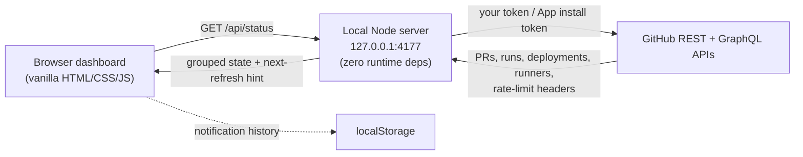

# GitHub Monitor

**One local dashboard for every open PR, CI run, deploy, and self-hosted runner across all your GitHub repos and orgs.**

[](https://github.com/GipsyChef/github-monitor/actions/workflows/ci.yml)
[](LICENSE)
[](https://nodejs.org)
[](package.json)

GitHub Monitor is a local-first dashboard built for maintainers and teams whose work is scattered across many repos and orgs. It solves the tab-juggling problem — browser tabs, Actions pages, and notification streams — so you can see merge-readiness and CI/CD state faster, in one place. It runs on `127.0.0.1`, talks directly to GitHub's REST and GraphQL APIs, stores **no token** and **no database**, and answers the questions a busy maintainer actually asks:

- Which PRs are **failing**, **still running checks**, or **green and ready to merge**?
- Which **deploy / release** workflows are running or recently failed?
- Are any **self-hosted runners** busy?
- Is my **GitHub API quota** getting tight?


> The dashboard UI is titled **PR Command Deck** — that's the in-app name for GitHub Monitor.

## At a glance

| | |
|---|---|
| **What** | Local-first dashboard for GitHub PRs, CI, CD, deployments, and runners |
| **Who** | Maintainers and teams with work spread across many repos and orgs |
| **Runs** | On your machine, bound to `127.0.0.1` — not a hosted service |
| **Stack** | Dependency-free Node HTTP server + vanilla HTML/CSS/JS |
| **Stores** | Nothing server-side; notification history lives in browser `localStorage` |
| **Auth** | Personal token, `gh` CLI token, or a GitHub App you own |
| **License** | MIT |

## Is this for you?

**✅ Use this when**

- You maintain or review across several repositories and orgs at once.
- You want CI/CD state and merge-readiness in one glance instead of many tabs.
- You'd rather run a small local tool than wire up a hosted service or grant a third party your token.

**❌ Look elsewhere if**

- You need a hosted, multi-user, or team-shared dashboard (this is local-first by design).
- You want long-term metrics, dashboards, or alerting history (it shows live state, not analytics).
- You can't run Node.js 22+ locally.

## Quick Start

**Prerequisites:** Node.js 22+ and one auth path (a `GITHUB_TOKEN`, a logged-in `gh` CLI, or a GitHub App — see [Authentication](#authentication)).

```bash
git clone https://github.com/GipsyChef/github-monitor.git
cd github-monitor
npm ci          # no runtime deps — just verifies the lockfile like CI does
npm start       # serves the dashboard
```

Then open **<http://127.0.0.1:4177>**.

Handy variants:

```bash
GITHUB_TOKEN=<your-token> npm start   # use an explicit token
PORT=4180 npm start                   # use a different port
npm run dev                           # guided launch: checks Node, credentials, and port, then starts the server
```

Prefer a config file? Copy [`.env.example`](.env.example) to `.env` and fill in what you need.

### Keep it running with launchd (macOS)

`npm start` and `npm run dev` both live in the foreground and die with their
terminal. Anything that polls this dashboard for queue depth sees failed reads
while it is down and holds its state rather than scaling, so a dashboard that
died overnight silently stops CI from getting runners. The checked-in
LaunchAgent keeps it up instead, and `start.sh` drives it:

```bash
./start.sh start           # install the LaunchAgent for this checkout, load it, wait until it answers
./start.sh status          # launchd state, uptime, /api/health quota, stale-code check, this run's log errors
./start.sh monitor 10      # the same report, refreshed every 10s until Ctrl-C
./start.sh restart         # reload it, e.g. after pulling a merged change
./start.sh stop            # unload it (it loads again at your next login)
./start.sh logs            # follow ~/Library/Logs/github-monitor.log
```

`status` exits 0 when healthy, 1 when nothing is serving, and 2 when the server
is up but needs attention — code on disk newer than the process, GitHub quota
paused, or the port held by something launchd did not start — so it can be
scripted.

The agent runs `node --env-file-if-exists=.env server.js` directly — a
launchd-spawned `/bin/bash` cannot read files under `~/Documents` (macOS blocks
it silently), so `start.sh` is never what launchd runs; it only installs and
controls the job. `start` writes `macos/com.ryabinski.github-monitor.plist` to
`~/Library/LaunchAgents/` with this checkout's path, your `node` and your
`$HOME` substituted in, and `start`/`restart` reload the job if that file has
changed. launchd starts it with your login session and restarts it after a
crash or a bare `kill`, at most once a minute.

## Authentication

Pick one path. The server never persists your credential.

1. **Personal access token** — set `GITHUB_TOKEN` or `GH_TOKEN`.
2. **GitHub CLI fallback** — if neither variable is set, the server runs `gh auth token` once to reuse your existing local login. Verify with `gh auth status`.
3. **GitHub App you own** — set `GITHUB_APP_ID` and `GITHUB_APP_PRIVATE_KEY_PATH` for higher, per-installation quota. See **[docs/github-app-setup.md](docs/github-app-setup.md)** for setup and quota trade-offs.

These are checked in reverse order: App auth wins when both variables are set, then `GITHUB_TOKEN`/`GH_TOKEN`, then `gh`. `npm run dev` checks only the path that will actually be used, so App auth does not require `gh` to be installed or logged in.

Token scopes you need depend on what you want to see:

| Goal | Access required |
|---|---|
| Read-only PR & Actions monitoring | Repository read |
| Self-hosted runner visibility | Actions runner access (owner or repo) |
| Rerunning failed CI/CD jobs | Actions write |
| Merging PRs from the dashboard | Write to the target repository |
| Optional deep-queue Dependabot cleanup | Actions and pull requests write |

> GitHub App permissions for the equivalent capabilities are documented in [docs/github-app-setup.md](docs/github-app-setup.md).

## What It Shows

- Open PRs from non-archived repositories, grouped by **passing**, **no-CI**, **failing**, **running**, **merge-conflict**, and **out-of-date** states
- Running non-CD GitHub Actions workflow runs, including jobs not represented by an open-PR status rollup
- Optional **CD/deploy/release/publish** workflow audit, plus CD runs finished in the last 24h and the latest failed CD runs from the last 3 days
- **Pipeline Traces** for PR journeys that have not completed from CI/merge through successful production CD
- Running GitHub deployments
- Busy org and (optional) repository-level self-hosted runners
- GitHub API request count, remaining quota, and reset time, with **adaptive next-refresh timing**
- Quota-aware pausing: when quota runs low, auto-refresh pauses and the manual refresh button is disabled until the reset window
- **Out of date**: PRs whose branch has fallen behind its base, with a one-click `Update branch` that merges the base in; the lane is exclusive, so a PR waiting on an update is not also listed as merely failing or passing
- Browser notifications and an in-app inbox for CI/CD completions, new conflicts, and PRs newly blocked on nothing but a branch update
- Optional **auto-merge** countdown for passing PRs with completed checks
- One-click reruns for failed CI/CD jobs and their dependent jobs, available on failed run, PR, and pipeline-trace cards
- Optional automatic Dependabot cleanup: closes PRs with failing CI, cancels queued runs once they reach the configured threshold, and auto-dismisses failed Dependabot runs from Failing CI

## How it works



- **Backend:** a single dependency-free Node HTTP server (`server.js`).
- **Frontend:** dependency-free HTML/CSS/JavaScript in `public/`.
- **No storage:** no database, no persisted token. The credential comes from `GITHUB_TOKEN`/`GH_TOKEN`, the `gh` CLI, or a GitHub App at request time.

**Guarded merges.** Merging from the dashboard re-checks the PR server-side first and rejects drafts, conflicts, failing checks, running checks, and no-CI PRs that GitHub doesn't currently report as mergeable. No-CI PRs that *are* mergeable can be merged manually. After a successful merge the server deletes the PR head branch. Auto-merge is **off by default**; when enabled it counts eligible PRs down for 15 seconds — even if the tab isn't active — then runs the same guarded merge. PRs can also be closed from the dashboard regardless of CI state.

> Under a GitHub App, if a target repo has a "Restrict who can push" branch-protection rule on the merge target, the App must be in that rule's allowlist or merges fail with `You're not authorized to push to this branch.` See [docs/github-app-setup.md](docs/github-app-setup.md#step-6--allow-the-app-through-branch-protection-push-restrictions).

**Adaptive refresh.** The server reads GitHub rate-limit headers on every response and returns the requests used, per-resource quota/remaining/reset, and a recommended next refresh time. The browser refreshes faster when PRs, CD actions, deployments, or runners are active, and slows down when things are quiet, expensive audits are on, or quota gets tight. Under GitHub App auth, each installation has its own quota bucket; the footer chip shows the *tightest* bucket and how many others exist (hover for the full breakdown). The notification inbox lives in `localStorage` and prunes entries older than 24h. Each alert is announced once and never re-fires for the same event across reloads, server restarts, or a pipeline briefly dropping out of the scan window (a per-tag ledger in `localStorage` tracks what was already announced), and events whose latest evidence is more than a few days old are not announced at all.

**Pipeline traces.** A merged PR is not flagged the moment a production CD run is missing. While post-merge CI is still queued or running on the base branch, the journey stays **active** — the CD run is queued behind it — and the "no matching production CD run" flag fires only after a four-hour window measured from merge, matching the CI and production-completion windows. Slow or busy pipelines therefore stop being reported as failures before CD has had a chance to start.

**Dismissing runs.** Only the *latest* completed run per lane (workflow + branch) surfaces under Failing CI, so a retried-and-passed run resolves the failure and stale older failures don't pile up. Remaining failing runs (post-merge CI, Dependabot, etc.) can be dismissed to clear them from the list; use **Show** in the dismissed bar to review or **Restore** them. Dismissals are a per-user view preference kept in your browser's `localStorage` and auto-expire after 30 days — there is deliberately **no server-side or external database** (e.g. DynamoDB), keeping the tool local-first and zero-dependency. Because they live in `localStorage`, dismissals **survive restarting the server and reloading the page**, but are scoped to that one browser profile — a different browser, machine, or incognito window starts with a clean slate. A dismissed lane reappears on its own if a brand-new run later fails.

**Rerunning failed jobs.** Failed GitHub Actions runs expose **Rerun failed**, which asks GitHub to rerun only failed jobs and their dependent jobs. A failed PR with more than one failed workflow queues each workflow from the same control. The button changes to **Rerun queued** after GitHub accepts the request; the normal adaptive refresh then replaces the stale failure with the new run state. The credential needs Actions write access.

**Dependabot cleanup.** This destructive server-side policy is **disabled by default**. Set `DEPENDABOT_QUEUE_THRESHOLD` to a positive integer to opt in. Once enabled, the server checks the selected owners every minute and does two things:

- **Closes failing Dependabot PRs at any queue depth.** Every open Dependabot PR whose head commit has a completed check run or commit status in a failed conclusion is closed — a lone red PR is not left waiting for a backlog to form. PRs with passing, pending, or unknown CI are never touched.
- **Cancels active Dependabot runs only past the threshold.** When that many unique GitHub Actions runs are queued, it also cancels every active Dependabot-triggered workflow run in scope.
- **Auto-dismisses failed Dependabot runs.** Dependabot's own update runs (for example `dependabot/dependabot-updates`) fail on Dependabot's schedule with no pull request to close and no active run to cancel, so cleanup can never resolve them and they would otherwise sit in Failing CI forever. With cleanup enabled they arrive pre-dismissed: out of the list and the Failing CI tile, still reachable behind the dismissed bar's **Show** toggle, and marked *Auto-dismissed*. This is a view-only decision — nothing is written to your `localStorage` dismissals, and **Restore all** never touches them.

Discovery is paginated, cleanup attempts have a five-minute cooldown, and low GitHub API quota pauses mutation. Use `DEPENDABOT_QUEUE_OWNERS` as a comma-separated owner allowlist; when omitted, all owners accessible to the credential are included. The credential must have Actions and pull-request write access.

## Configuration

All optional except your chosen auth path. Set via environment or `.env`.

| Variable | Purpose |
|---|---|
| `GITHUB_TOKEN` / `GH_TOKEN` | Personal access token for API calls and merges |
| `GITHUB_APP_ID` | GitHub App ID (App auth path) |
| `GITHUB_APP_PRIVATE_KEY_PATH` | Path to the App's private key (`0600`, kept outside the repo) |
| `PORT` | Dashboard port (default `4177`) |
| `OPEN_PRS_JOBS` | Parallelism for the open-PR scan |
| `SCAN_PUSHED_WITHIN_HOURS` | Skip repos with no push in this window (default `168`; `0` scans everything) |
| `SCAN_REPO_FLOOR` | Always scan this many most-recently-pushed repos, whatever the window says (default `10`) |
| `DEPENDABOT_QUEUE_THRESHOLD` | Enables Dependabot cleanup (disabled by default); its value (`1`–`5000`) is the queued workflow-run depth that additionally triggers run cancellation |
| `DEPENDABOT_QUEUE_OWNERS` | Optional comma-separated owner allowlist for automatic cleanup |
| `AUTO_DISMISS_CANCELLED_RUNS` | Set to `0` to keep cancelled workflow runs in the actionable Failing CI and Failed CD lists (auto-dismissed by default) |
| `ETAG_CACHE_DISABLED` | Set to `1` to disable conditional-request caching (debugging) |

### Scan scope

Most of a scan's cost is per repo — workflows, runs, deployments, runners — and on an account with many repositories most of that is spent on repos nobody has touched in weeks. `SCAN_PUSHED_WITHIN_HOURS` (default one week) skips them.

Three things keep a repo in scope regardless of when it was last pushed: an open pull request, a missing or unreadable `pushed_at`, and being among the `SCAN_REPO_FLOOR` most recently pushed. The floor matters most — without it a quiet fortnight would empty the dashboard while looking like a successful scan.

When repos are skipped, the **Repos** count says how many and why on hover. Set `SCAN_PUSHED_WITHIN_HOURS=0` to scan everything.

### Dashboard controls

- **All owners** — your repos plus every org GitHub returns
- **Owned** — repositories owned by your user
- **Mine** — PRs you authored
- **CD audit** — scan CD/deploy/release/publish workflows, recent CD runs, failed latest runs, and running deployments
- **Pipeline Traces** — flag PR journeys that fail, skip, stall, or cannot be mapped before successful production CD
- **Busy runners** — scan owner/org self-hosted runners
- **Auto refresh** — schedules the next scan adaptively with a live countdown
- **Auto merge** — counts passing PRs (with completed checks) down for 15s, then merges

## API

```text
GET  /api/status?mode=all&includeCd=1&includeRunners=0&includeRepoRunners=0&jobs=4
GET  /api/runners/status?mode=all&includeRepoRunners=0&jobs=4
POST /api/pull-request/merge
POST /api/pull-request/close
POST /api/pull-request/update-branch
GET  /api/health
```

- `mode` is `all`, `owned`, or `mine`.
- `POST /api/pull-request/update-branch` takes `{ repo, number }` and merges the base branch into the PR's head. It never rebases, so the contributor's head branch is never force-pushed. GitHub's own refusal is passed through verbatim: a branch-protection rule that blocks the App and a fork nobody can push to are different problems.

- The runner endpoint returns only busy self-hosted runners; set `includeRepoRunners=1` to include repo-level runners.
- Merge/close requests take JSON like `{"repo":"owner/name","number":123}`. Merge re-checks the PR (see [guarded merges](#how-it-works)) and deletes the head branch on success; close skips CI requirements.

## Security

The server binds to `127.0.0.1` and is meant for a trusted local machine. It uses your token (or App installation tokens) for API calls and dashboard-triggered merges, so **don't expose it to an untrusted network**.

Never commit `.env` files, real tokens, GitHub App private keys (`*.pem`), screenshots containing private repo data, or logs with private repo names. Store App private keys outside this repo with mode `0600` and treat them as sensitive as the PAT they replace.

To report a vulnerability, follow [SECURITY.md](SECURITY.md) — do not open a public issue.

## Development

```bash
npm test     # node --test plus a syntax check (npm run check)
npm run dev  # startup helper: verifies Node, credentials, port, then opens the dashboard
```

GitHub Monitor is distributed as source — there are no runtime npm dependencies, so `npm ci` simply verifies the lockfile.

## Contributing & support

New contributors should start with **[docs/COMMUNITY.md](docs/COMMUNITY.md)** (intended audience, good first contributions, support boundaries, security-sensitive areas). See also [CONTRIBUTING.md](CONTRIBUTING.md), [CODE_OF_CONDUCT.md](CODE_OF_CONDUCT.md), and [SUPPORT.md](SUPPORT.md).

This is a small local utility, so support is best-effort: use GitHub issues for reproducible bugs and focused feature requests. Hosted multi-user deployment and debugging private repos without a minimal reproduction are out of scope.

## License

MIT — see [LICENSE](LICENSE).
